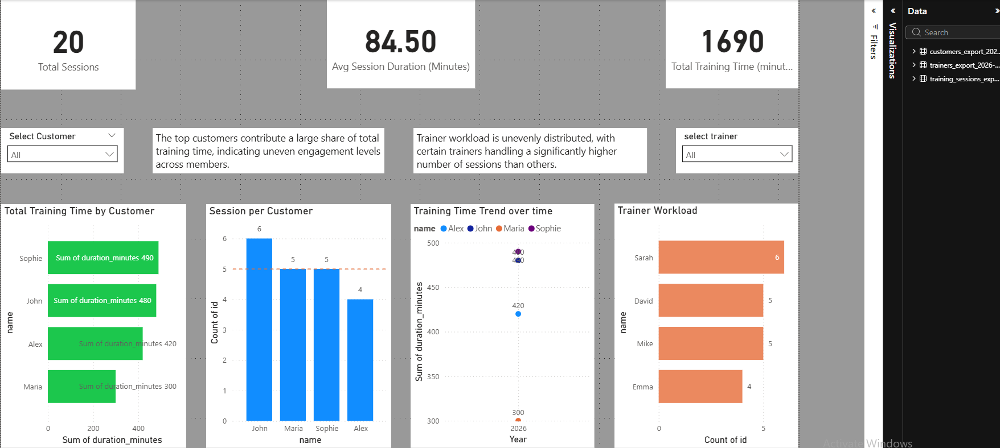

# 🏋️ Fitness Analytics Dashboard (SQL + Power BI)

## 📊 Project Overview

This project simulates a fitness training business to analyze customer engagement, session behavior, and trainer workload using **SQL and Power BI**.

The goal is to demonstrate end-to-end analytical skills — from data modeling and querying to visualization and business insights.

---

## 🧱 Database Structure

The database consists of three main tables:

* `customers` → stores customer information
* `trainers` → stores trainer information
* `training_sessions` → tracks each training session

Each training session is linked to:

* one customer
* one trainer

---

## 📂 Project Files

* `schema.sql` → Creates tables and defines relationships
* `data.sql` → Inserts structured sample data
* `queries.sql` → Analytical SQL queries (basic → advanced)
* `fitness-dashboard.pbit` → Power BI dashboard
* `dashboard-preview.png` → Dashboard screenshot
* `README.md` → Project documentation

---

## 🛠️ Tools Used

* SQL (data modeling, querying, analysis)
* Power BI (dashboard and visualization)
* DAX (basic measures and calculations)

---

## 📈 Dashboard Preview



---

## 🧠 Key Insights

* A small group of customers contributes a large share of total training time, indicating that engagement is concentrated among high-activity users.
* Trainer workload is unevenly distributed, with certain trainers handling a significantly higher volume of sessions than others.

---

## 📊 Business Questions Answered

1. Who are the most active customers?
2. Which trainer handles the most sessions?
3. Which customers train above average?
4. Who are the top-performing customers?
5. How does training accumulate over time?
6. Which trainer does each customer prefer?

---

## 🚀 Example Advanced Query (Ranking)

```sql
SELECT
  c.name,
  SUM(ts.duration_minutes) AS total_minutes,
  RANK() OVER (ORDER BY SUM(ts.duration_minutes) DESC) AS rank
FROM training_sessions ts
JOIN customers c ON ts.customer_id = c.id
GROUP BY c.name;
```

---

## 🎯 Key Metrics (Dashboard)

* Total Sessions
* Average Session Duration (Min)
* Total Training Time (Min)

---

## 🎯 Purpose

This project demonstrates the ability to:

* Design relational databases
* Write structured SQL queries
* Build interactive dashboards
* Translate data into business insights

---

## 🚀 Project Highlights

* Built a structured Power BI dashboard with KPIs, trends, and workload analysis
* Applied DAX for calculated metrics and filtering logic
* Designed with consistent layout, spacing, and business-focused storytelling

---

## 📌 Future Improvements

* Add customer retention tracking
* Include revenue metrics per session
* Expand dataset for deeper trend analysis

---

## 👤 Author

Ernesto
